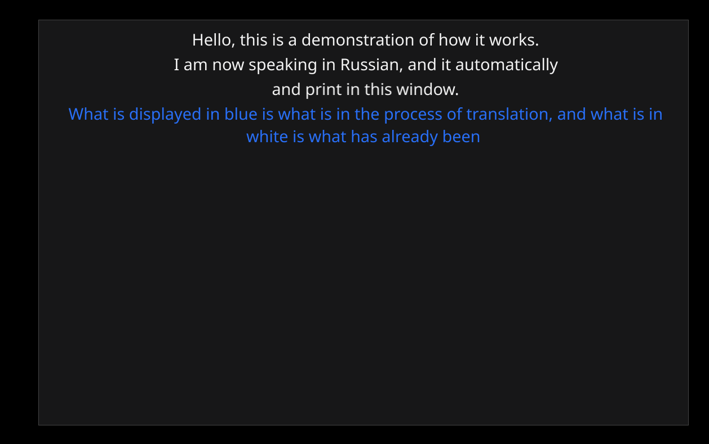

# `speech`

This is a library for Speech-To-Text operations in Go, and 2 tools to demonstrate how to use it:
* [`./cmd/stt`](./cmd/stt/main.go) -- just converts a PCM_F32_LE stream into transcription (by default translated to English).
* [`./cmd/subtitleswindow/main.go`](./cmd/subtitleswindow/main.go) -- is a window that dynamically displays subtitles to be used in OBS, given a link to the audio stream (e.g. your RTMP link).

Currently, we provide API for using Whisper directly and/or for using whisper via HTTP API.

# Quick start

### `stt`

If you use Linux:
```sh
WHISPER_MODEL=medium ENABLE_CUDA=true make example-stt
```
(keep in mind: the larger model is the more time it takes to warm up)

It likely will fail to build, because you don't have CUDA libraries install. You need to install them. But if it will run; it will start listening the microphone, and you can start speaking. It should print the translation of your speech to English.

For example in my case:
```
WHISPER_MODEL=medium ENABLE_CUDA=true make example-stt
[...a lot of log...]
   23.3s -    26.3s:  Hello.
     28s -    30.6s:  This is just a demonstration that the thing works properly.
   30.7s -    37.9s:  And somehow it does work properly, which is weird.
```

### `subtitleswindow`

Run:
```sh
ENABLE_CUDA=true make example-subtitleswindow
```
It should start a window that automatically translates your speech (it listens the microphone):




If you need to translate a speech given an RTMP/RTSP/SRT/whatever link, then:

Build:
```sh
ENABLE_CUDA=true make subtitleswindow-linux-amd64
```

Run:
```sh
(cd ./thirdparty/whisper.cpp && ./models/download-ggml-model.sh medium)
./build/subtitleswindow-linux-amd64 thirdparty/whisper.cpp/models/ggml-medium.bin rtmp://my.server:1935/myapp/mystream/
```

A window will pop up, and you'll see that it displays the most recent transcriptions. You can add this window in OBS to have live translation of your speech on your stream screen:

### `subtitleswindow` with computing on a remote server

On the remote server run:
```sh
ENABLE_CUDA=true make sttd-linux-amd64
(cd ./thirdparty/whisper.cpp && ./models/download-ggml-model.sh large-v3)
./build/sttd-linux-amd64 --log-level trace 0.0.0.0:1234 --default-model-file thirdparty/whisper.cpp/models/ggml-large-v3.bin
```

Now on your local computer run:
```sh
make subtitleswindow-linux-amd64
./build/subtitleswindow-linux-amd64 --remote-addr address-of-my-remote-server:1234 --translate=true --language en-US ''
```

